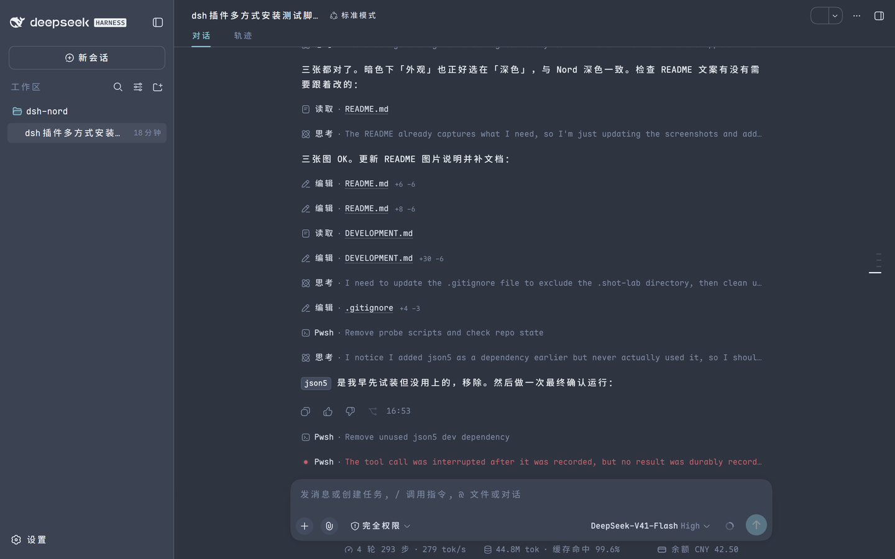
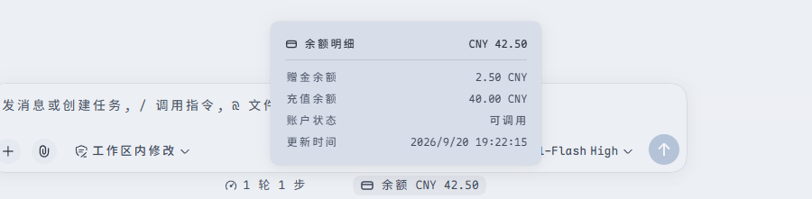
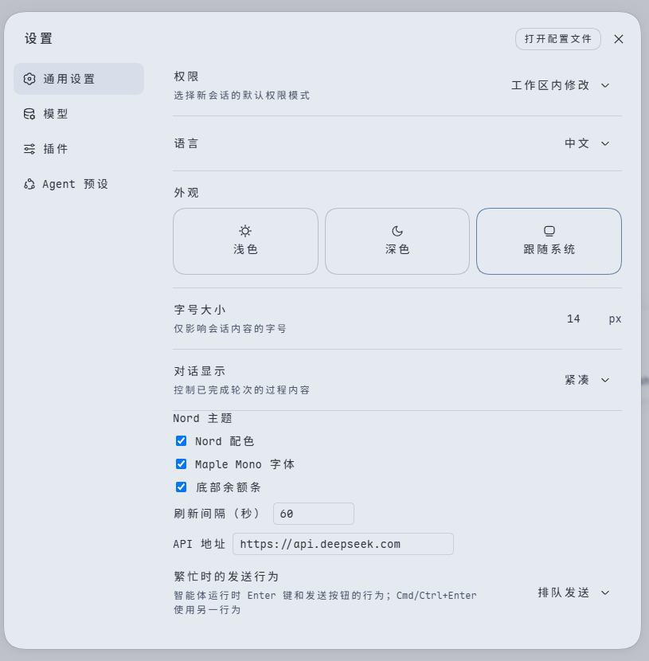

# dsh-nord

[中文](https://github.com/verdana/dsh-nord/blob/main/README.md) | **English**

A Nord repaint for the [dsh](https://github.com/deepseek-ai/deepseek-harness) Web GUI: the Nord palette, selectable fonts, a settings page of its own, and a DeepSeek balance readout under the composer.



## Features

- **Nord palette** —— 116 design tokens, one set for light and one for dark, following dsh's own *Appearance* setting. No hard-coded colors, no DOM surgery, and uninstalling restores everything.
- **Selectable fonts** —— Interface font and code font are chosen separately: follow the system, one of eight presets (Maple Mono, JetBrains Mono, Cascadia Code, Fira Code, Sarasa Gothic, LXGW WenKai, HarmonyOS Sans, MiSans), or your own CSS `font-family` string. A preset is a full fallback stack, so a family you don't have installed drops through to the next one, with CJK fallbacks appended by the plugin; every row in the dropdown renders in its own font, so you see the real result before you pick it. The UI font size still derives from dsh's *Font size* setting.
- **Balance readout** —— Below the composer, on the same row as the official turn/step stats. Click it for a detail panel. With a DeepSeek model (or when the balance endpoint itself is DeepSeek), the panel gains a *Usage* row linking to [platform.deepseek.com/usage](https://platform.deepseek.com/usage); panels for other providers are left untouched.

  

- **A settings page of its own** —— The settings panel's left nav gains a *Nord theme* entry after the official sections; the plugin no longer squeezes rows into *General*. The page is grouped into appearance, fonts, and the balance bar.

  

> The screenshots show the dark scheme (light is driven by the other half of the same token set). All three are re-shot in an isolated instance by `node scripts/shots/capture.mjs` — see [DEVELOPMENT.md](DEVELOPMENT.md#截图怎么来的) (Chinese).

- **No more jittering wide tables** —— Fixes a layout bug in dsh itself: hovering the bottom edge of a wide markdown table makes it flicker, because the hover state reserves a different height than the resting state. The patch pins `md-table-wide` at a plain `overflow-x: auto` — no DOM writes, restored on uninstall. The cost is that a wide table too wide to fit now always shows a horizontal scrollbar (wide tables that do fit keep showing none). Details in [DEVELOPMENT.md](DEVELOPMENT.md#宽表格为什么被钉在-auto) (Chinese).

## Requirements

- dsh **`0.2.0-rc.2`** (npm `latest` and `next`) —— the build baseline, tested end to end; **`0.1.5-rc.3`** and **`0.1.7-rc.2`** are supported and each tested as well, and `0.1.5-rc.1` / `0.1.5-rc.2` differ in nothing this plugin touches. The settings mechanism changed twice (`settingsScope` → `configForms`, `installSection` removed, and 0.2.0 deleted the `settingsScope` declarations outright); the plugin branches at runtime, so you don't install a different package per version. Other versions: [DEVELOPMENT.md](DEVELOPMENT.md#版本现实) (Chinese).
- The balance readout needs `DEEPSEEK_API_KEY` (resolved through dsh's credentials service). Without credentials the bar shows an error message; theme, fonts, and settings are unaffected.

## Install

From npm:

```sh
dsh plugin --profile web add dsh-nord@^0.2.0
dsh web
```

Write a range like `^0.2.0` rather than letting pnpm resolve `latest`. Since pnpm 11 there is a 24-hour "new version cooldown": while a release is less than a day old, `@latest` does not resolve to it and silently installs the previous version instead (an easy trap right after publishing). For an exact version, spell it out: `dsh-nord@0.2.0`.

From this repository's source:

```sh
npm install && npm run build
dsh plugin --profile web add .
dsh --profile web --dump-config   # should show "# == dsh-nord"
dsh web
```

Straight from GitHub:

```sh
dsh plugin --profile web add github:verdana/dsh-nord#main
```

`#main` takes the tip of the branch; replace `main` with a commit sha to pin one.

Installing from git requires you to approve the package's build script (`allowBuilds`) in your profile's `pnpm-workspace.yaml`. dsh prints the exact line to paste on the first failure — that approval means letting the package run code at install time, so only do it for sources you trust. If you don't want users to take that step, install from npm or a local path as above.

Uninstall: `dsh plugin --profile web remove dsh-nord`.

## Settings

Settings panel → left nav *Nord theme* (after General, Models, Plugins, and Agent presets):

| Field | Default | Meaning |
|---|---|---|
| `themeEnabled` | true | Apply the Nord palette |
| `fontEnabled` | true | Replace the font stacks; turn off to go back to dsh's own fonts |
| `uiFont` | `maple` | Interface font: preset id, `system`, or `custom` |
| `uiFontCustom` | empty | CSS `font-family` list used when `uiFont: custom` |
| `codeFont` | `maple` | Code font: preset id, `system`, `inherit` (follow the interface font), or `custom` |
| `codeFontCustom` | empty | CSS `font-family` list used when `codeFont: custom` |
| `balanceEnabled` | true | Show the balance bar at the bottom |
| `refreshSeconds` | 60 | Balance refresh interval, 15–3600 |
| `baseURL` | `https://api.deepseek.com` | Balance endpoint |

Preset ids: `maple`, `jetbrains`, `cascadia`, `fira`, `sarasa`, `lxgw`, `harmony`, `misans`.

You can also override by `id: dsh-nord` in the profile's `cordis.patch.yml`. A patch **replaces** the target row's whole `config`, so restate every key (missing keys fall back to schema defaults, so an old patch still boots):

```yaml
- id: dsh-nord
  config:
    themeEnabled: true
    fontEnabled: true
    uiFont: maple
    uiFontCustom: ''
    codeFont: inherit
    codeFontCustom: ''
    balanceEnabled: true
    refreshSeconds: 60
    baseURL: https://api.deepseek.com
```

`uiFontCustom` / `codeFontCustom` take CSS `font-family` syntax, comma-separated, e.g. `'LXGW WenKai', 'Microsoft YaHei'`. The plugin keeps only the family names it can recognize (semicolons, braces, quotes, parentheses and the like are dropped), re-quotes them, and appends CJK fallbacks; generic families such as `sans-serif` stay unquoted.

## License

[MIT](LICENSE)
