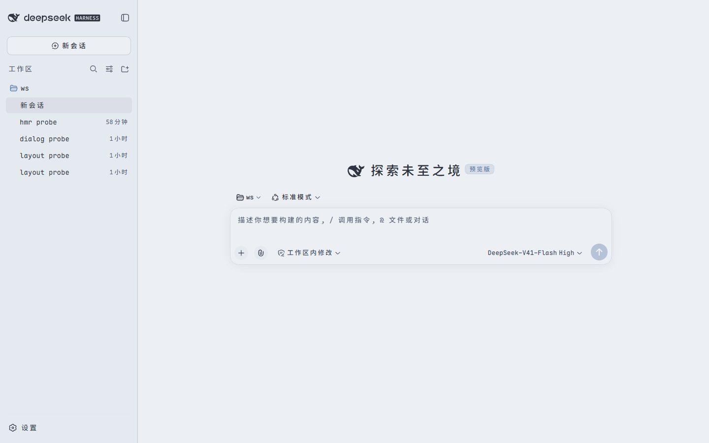
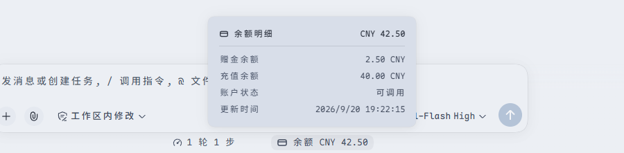
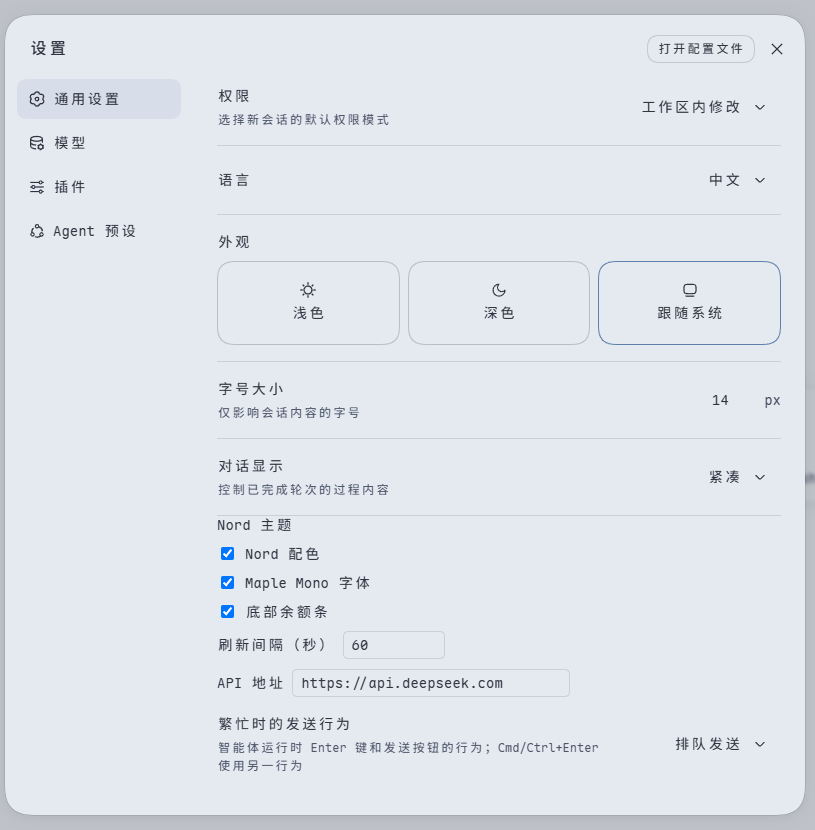

# dsh-nord

给 [dsh](https://github.com/deepseek-ai/deepseek-harness) Web GUI 换一套 Nord：Nord 配色、Maple Mono 字体栈、设置页开关，以及 composer 下方的 DeepSeek 余额读数。



## 功能

- **Nord 配色** —— 116 个设计 token，浅色与深色两套，跟随 dsh 的「外观」设置切换；不写死颜色、不改 DOM，卸载即还原。
- **Maple Mono 字体** —— 界面字体与代码字体一起换，跟随「字号大小」设置派生。
- **余额读数** —— composer 下方，与官方的轮次/步骤统计在同一行。点击弹出明细面板。

  

- **设置行** —— 设置 → 通用 → Nord 主题，三项开关加上刷新间隔与 API 地址。

  

## 环境要求

- dsh **`0.1.5-rc.1`** —— 开发与验证所用的版本。其他版本见 [DEVELOPMENT.md](DEVELOPMENT.md#版本现实)。
- 余额读数需要 `DEEPSEEK_API_KEY`（由 dsh 的 credentials 服务解析）。没有凭据时余额条显示错误文案，主题、字体、设置不受影响。

## 安装

从 npm：

```sh
dsh plugin --profile web add dsh-nord
dsh web
```

从本仓库源码：

```sh
npm install && npm run build
dsh plugin --profile web add .
dsh --profile web --dump-config   # 应出现 "# == dsh-nord"
dsh web
```

从 GitHub 直接装（`<owner>` 换成仓库所有者，可锁定 commit）：

```sh
dsh plugin --profile web add github:<owner>/dsh-nord#<sha>
```

git 安装需要你在 profile 的 `pnpm-workspace.yaml` 里为该包授权构建脚本（`allowBuilds`），dsh 首次失败时会提示要粘贴的确切内容——这项授权等于允许该包在安装期执行代码，只对可信源码开放。不想让用户做这步，就用上面的 npm 或本地路径安装。

卸载：`dsh plugin --profile web remove dsh-nord`。

## 设置

设置 → 通用 → Nord 主题：

| 字段 | 默认 | 说明 |
|---|---|---|
| `themeEnabled` | true | 叠加 Nord 配色 |
| `fontEnabled` | true | 替换字体栈 |
| `balanceEnabled` | true | 显示底部余额条 |
| `refreshSeconds` | 60 | 余额刷新间隔，15–3600 |
| `baseURL` | `https://api.deepseek.com` | 余额接口地址 |

也可以在 profile 的 `cordis.patch.yml` 里按 `id: dsh-nord` 覆盖。patch 会**整体替换**目标行的 `config`，所以要重述所有键：

```yaml
- id: dsh-nord
  config:
    themeEnabled: true
    fontEnabled: true
    balanceEnabled: true
    refreshSeconds: 60
    baseURL: https://api.deepseek.com
```

## 开发

见 [DEVELOPMENT.md](DEVELOPMENT.md)：项目结构、机制说明、开发循环、验证记录、发布步骤。

## 许可

[MIT](LICENSE)
